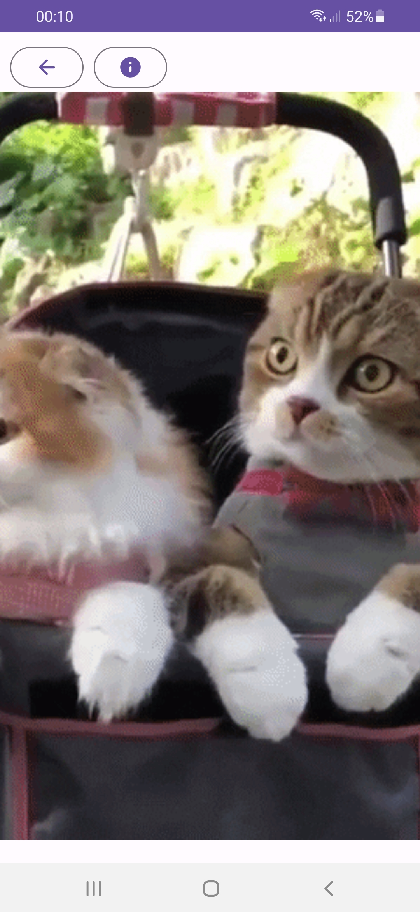
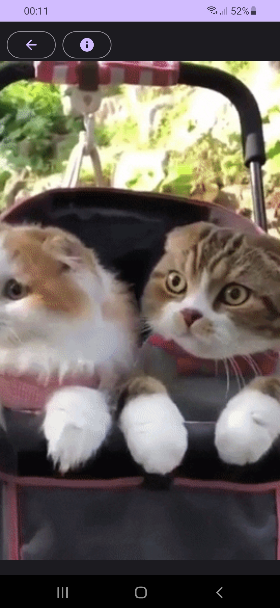
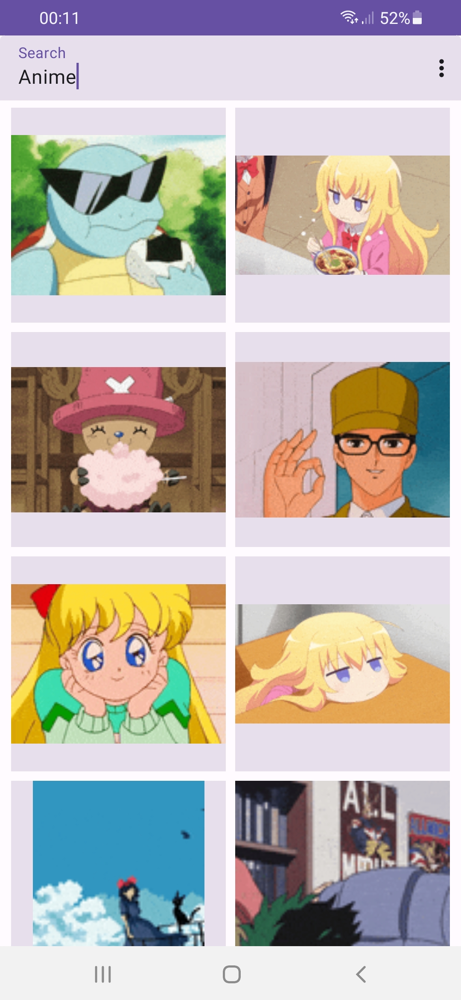

# giphylike
Test project to trainee position

## Goal
Making native Android application for searching gifs from giphy by using their API

## Technology
Jetpack Compose, Kotlin, Retrofit, Coil

## Screenshots

### Main screen. Search = Default

| Light Theme  | Dark Theme |
| ------------- | ------------- |
|   |   |

### Main screen. Rating changing
| Light Theme  | Dark Theme |
| ------------- | ------------- |
|   |   |

### Gif details screen. Zoomed
| Light Theme  | Dark Theme |
| ------------- | ------------- |
|   |   |

### Gif details screen. Normal
| Light Theme  | Dark Theme |
| ------------- | ------------- |
|   |   |

### Gif screen. Search = Anime
| Light Theme  | Dark Theme |
| ------------- | ------------- |
|   |   |
