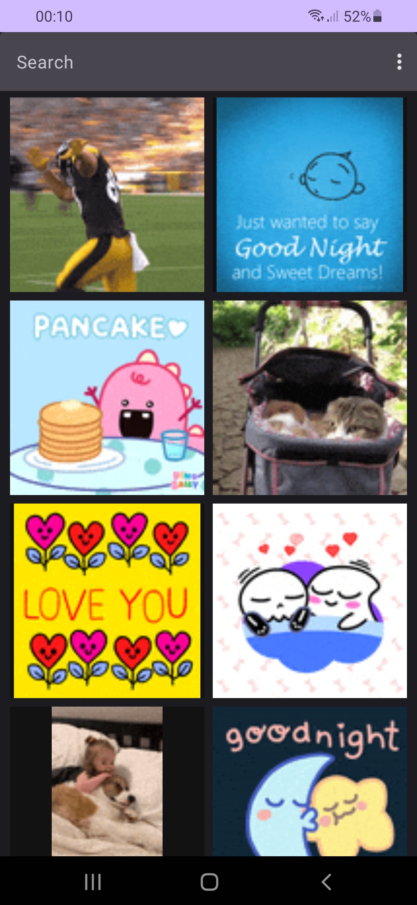
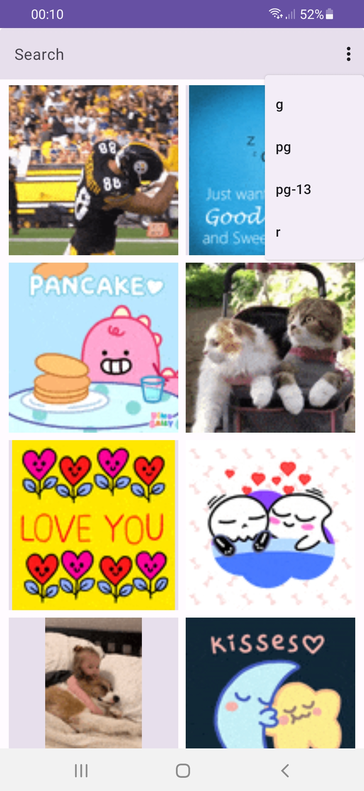
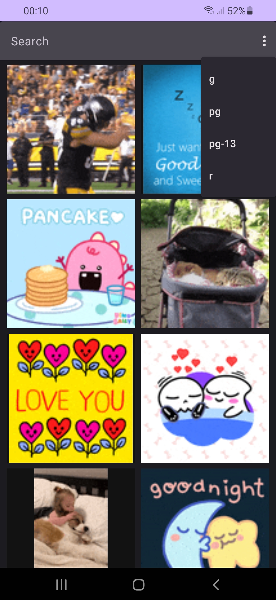

# giphylike
Test project to trainee position

## Goal
Making native Android application for searching gifs from giphy, using their API

## Technology
Jetpack Compose, Kotlin, Retrofit, Coil

## Screenshots

### Main screen. Search = Default

### Main screen. Rating changing

### Gif details screen. Zoomed

### Gif details screen. Normal

### Gif screen. Search = Anime

